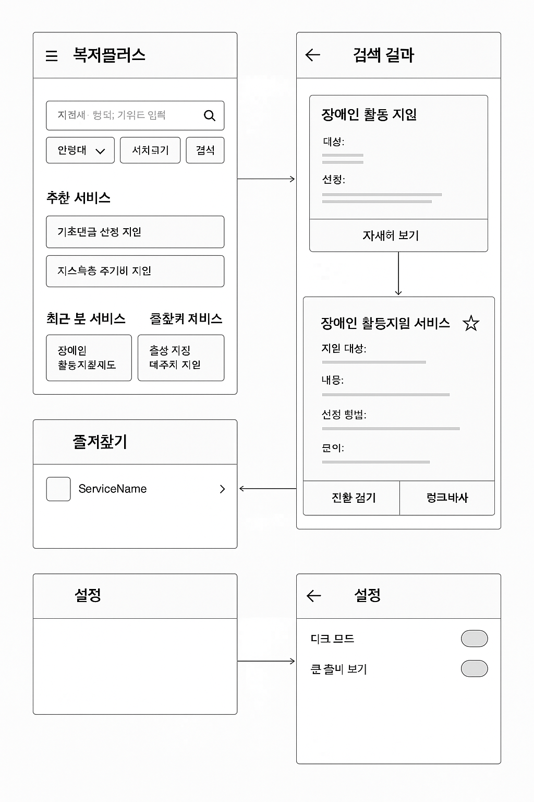

# 복지플러스

> 지자체 복지 서비스를 쉽게 찾고 신청할 수 있도록 돕는 웹 앱





### 🎯 주요 기능 (스토리보드 기반)

| 기능                | 설명                                             |
| ------------------- | ------------------------------------------------ |
| 1. 복지 서비스 검색 | 지역, 연령대, 키워드로 복지 서비스 검색          |
| 2. 상세 서비스 보기 | 지원대상, 내용, 신청방법, 담당기관 정보 제공     |
| 3. 즐겨찾기         | 관심있는 복지서비스 즐겨찾기 (localStorage 활용) |
| 4. 최근 본 서비스   | 최근 확인한 서비스 목록 (localStorage)           |
| 5. 공유하기         | 서비스 링크 복사 / 카카오톡 공유 버튼            |
| 6. 접근성 강화      | 큰 글씨 보기 / 다크모드 (toggle로)               |

### 🧭 페이지 구성 (스토리보드)

1. 홈페이지 (MainPage)

-   상단 검색창 (지자체, 연령대, 키워드)
-   추천 서비스 리스트
-   최근 본 서비스, 즐겨찾기 서비스 요약

2. 검색 결과 페이지 (SearchResultPage)

-   조건 필터 결과 목록
-   카드 형식으로 서비스 요약 표시

3. 서비스 상세 페이지 (ServiceDetailPage)

-   지원대상, 내용, 신청방법, 담당기관, 연락처 등
-   [⭐ 즐겨찾기] [📤 공유하기]

4. 즐겨찾기 페이지 (FavoritePage)

-   localStorage에 저장된 서비스 리스트

5. 설정 페이지 (SettingsPage)

-   다크모드
-   큰 글씨 보기

### 🖼 와이어프레임 (초안 설명)

#### 1. MainPage

```
+------------------------------------------------+
| 🏠 복지플러스 |
+------------------------------------------------+
| [🔍] 지역 | 연령대 ▼ | 키워드 입력 [검색] |
+------------------------------------------------+
| 👑 추천 서비스 |
| - 기초연금 신청 지원 |
| - 저소득층 주거비 지원 |
+------------------------------------------------+
| 🕓 최근 본 서비스 | ⭐ 즐겨찾기 서비스 |
| - 장애인 활동지원제도 | - 출산 가정 바우처 지원 |
+------------------------------------------------+

```

#### 2. SearchResultPage

```

[← 뒤로가기] 검색결과 (총 23건)

+-------------------------------+
| 서비스명: 장애인 활동 지원 |
| 대상: 등록장애인 |
| 신청: 읍면동 주민센터 |
| [자세히 보기] |
+-------------------------------+

```

#### 3. ServiceDetailPage

```
[← 뒤로가기]       [⭐ 즐겨찾기] [📤 공유]

제목: 장애인 활동지원 서비스

지원 대상:
 - 등록된 중증 장애인
내용:
 - 활동보조 인력 지원
신청 방법:
 - 주소지 주민센터 방문 신청
문의:
 - 보건복지콜센터 129

[📞 전화 걸기] [링크 복사]
```

### 🧩 사용 기술

-   React (CRA or Vite)
-   React Router (페이지 전환)
-   Axios (오픈 API 호출)
-   localStorage (즐겨찾기, 최근 본 항목 저장)
-   Tailwind CSS (또는 styled-components)
-   카카오 공유 API (선택)
-   공공데이터포털 API: 한국사회보장정보원\_지자체복지서비스
