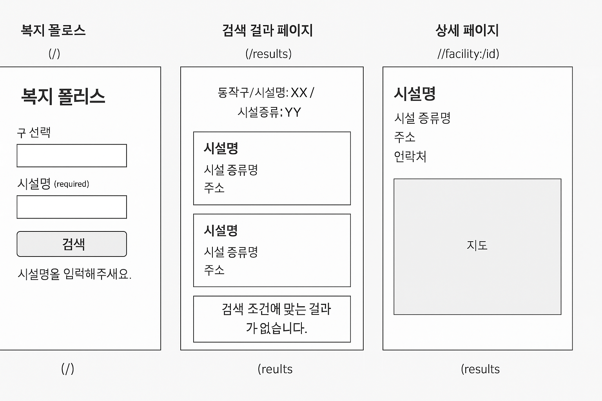

# 📘 서울 사회복지시설 검색 웹앱 스토리보드

> 서울특별시 동작구 사회복지시설 데이터를 기반으로,
> 사용자가 원하는 시설을 검색하고 상세 위치까지 확인할 수 있는 웹 애플리케이션입니다.

---

## 🏠 1. 메인페이지 (`/`)

### ✅ 화면 구성

-   **타이틀**: `복지 플러스`
-   **입력 폼**
    -   🔽 **구 선택**: [`동작구`,`종로구`] _(optional)_
    -   🔤 **시설명**: `TextField` _(✅ required)_
    -   🏢 **시설 종류명**: `TextField` _(optional)_
-   **버튼**
    -   🔍 `검색`

### ✅ 유효성 검사

-   시설명 미입력 시:  
    → `"시설명을 입력해주세요."` 경고 or 모달 표시  
    → 검색 요청 차단

---

## 🔍 2. 검색 결과 페이지 (`/results`)

### ✅ 화면 구성

-   **상단 필터 요약**:  
    `"동작구 / 시설명: XX / 시설종류: YY"` 등
-   **결과 리스트**: 카드 형식 목록
    -   시설명
    -   시설 종류
    -   주소
    -   연락처
-   **결과 없음**
    -   `"검색 조건에 맞는 결과가 없습니다."` 메시지 출력

### ✅ 클릭 시

-   리스트 항목 클릭 → 상세 페이지(`/facility/:id`) 이동

---

## 📍 3. 상세 페이지 (`/facility/:id`)

### ✅ 화면 구성

-   **시설명 (타이틀)**
-   **시설 종류명**
-   **시설 주소**
-   **전화번호**
-   **지도 (카카오지도 API 연동)**  
    → 주소 기반 위치 마커 표시

---

## 🔁 전체 흐름

1. 사용자가 메인화면에서 검색 조건 입력
2. 검색결과 페이지에서 조건에 맞는 목록 표시
3. 시설 클릭 시 상세 정보 + 지도 노출

---

## 📦 사용 데이터

-   **서울특별시 동작구 사회복지시설 목록**
-   **서울특별시 종로구 사회복지시설 목록**
-   파일 출처: 사용자 제공 `.xls`

---

## 📌 기술 스택

-   React (Vite)
-   React Router
-   Axios
-   카카오 지도 API
